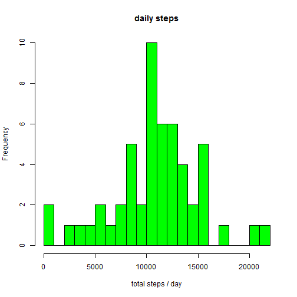

Author: Peter Müller

## Overview

This assignment makes use of data from a personal activity monitoring device. This device collects data at 5 minute intervals through out the day. The data consists of two months of data from an anonymous individual collected during the months of October and November, 2012 and include the number of steps taken in 5 minute intervals each day.

### Loading and preprocessing the data


```r
# loading the data
activity <- read.csv("activity.csv", colClasses = c("numeric", "character", "numeric"))
# convert to date
activity$date <- as.Date(activity$date, "%Y-%m-%d")
```

### What is mean total number of steps taken per day?

# total number of steps for each day

```r
dailySteps <- aggregate(steps ~ date, data = activity, FUN=sum, na.rm = TRUE)
# draw histogramm
hist(dailySteps$steps, main = "daily steps", xlab = "total steps / day", col = "green")
```

 

The mean is 10766.19 and median is 10765.

### What is the average daily activity pattern?

### Imputing missing values

### Are there differences in activity patterns between weekdays and weekends?


